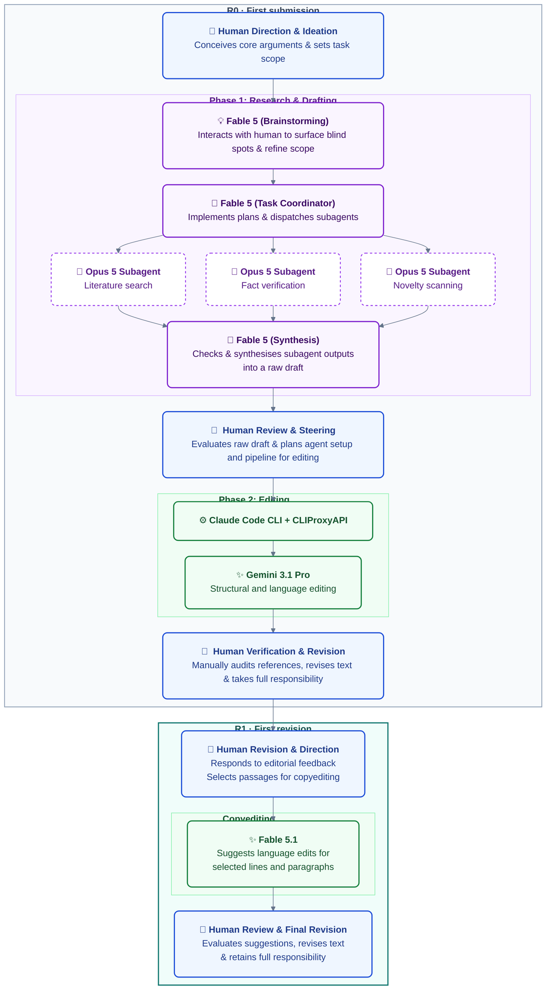

# Generative AI process records for a medical ethics commentary

This repository documents how generative AI was used for the first submission and revision of *Available upon reasonable request: the authorship function that was already dead* at [*JME Practical Bioethics*](https://jmepb.bmj.com/).

The purpose of this repository is transparency. It gives readers a clearer view of which AI tools were used, what they were asked to do, and how their outputs contributed to the manuscript. It is written for readers with or without a technical background.

## Process at a glance

In simple terms, the author supplied the ideas, source material, and direction. AI tools helped search and organize the literature, check specific facts, draft an early version, and improve its structure and language. During R1, Fable 5.1 through Claude Cowork provided copyediting suggestions. The author reviewed and revised the work and remains responsible for the manuscript.

The three key Fable 5 prompts were used during first-submission drafting. They are deposited verbatim in the R0 Cowork record; they were added to this repository when it was updated for R1. Fable 5.1 copyediting during revision is recorded as a use summary only.

## Repository contents

| File | What it contains |
| --- | --- |
| [`Claude_Cowork_R0_process_record.yaml`](Claude_Cowork_R0_process_record.yaml) | A first-submission record of the Claude-assisted literature search, fact-checking, novelty scan, synthesis, and initial drafting, including three verbatim key prompts, historical context, and attachment descriptions. |
| [`Claude_Code_CLI_R0_process_record.yaml`](Claude_Code_CLI_R0_process_record.yaml) | A record of the structural and language editing performed by Gemini 3.1 Pro. It records the versions of Claude Code CLI, [CLIProxyAPI](https://github.com/router-for-me/CLIProxyAPI), and [george-orwell-skill](https://github.com/Emberwhirl/george-orwell-skill) versions used for the session. The original editing prompt is preserved. |
| [`Claude_Cowork_R1_process_record.yaml`](Claude_Cowork_R1_process_record.yaml) | A summary of Fable 5.1 copyediting through Claude Cowork during R1. No verbatim prompts are deposited for these exchanges. |
| [`CHANGELOG.md`](CHANGELOG.md) | Changes since the archived first-submission version. |

`R0` identifies the first submission and `R1` the first revision. Verbatim prompts are stored directly in the relevant YAML record. R1 copyediting is summarised only.

YAML is a plain-text format for structured information. The three YAML files can be read directly in a web browser or text editor. No specialist software is required.

## Tools and recorded versions

The tables below record the models, agent environments, and supporting tools used in preparing the manuscript. Versions are those used at the time, where known; they are not necessarily the latest available versions.

### AI models

| Name | Version or identifier |
| --- | --- |
| Claude Fable 5 | `claude-fable-5` |
| Claude Fable 5.1 | `claude-fable-5-1` |
| Claude Opus 5 | `claude-opus-5` |
| Gemini 3.1 Pro | `gemini-3.1-pro-preview` |

### Agent environments and harnesses

| Name | Version |
| --- | --- |
| Claude Code CLI | `2.1.233` |
| Claude Cowork | Unavailable (online service) |

### Supporting tools and skills

| Name | Version |
| --- | --- |
| [CLIProxyAPI](https://github.com/router-for-me/CLIProxyAPI) | `7.2.86` |
| [george-orwell-skill](https://github.com/Emberwhirl/george-orwell-skill) | `0.1.0` |

These details improve the interpretability of the process records, but they do not create a fully reproducible software environment. In particular, managed services may change without exposing a platform version, and model outputs remain stochastic.

## Human responsibility

The AI systems are not listed as authors. The human author developed the central arguments, selected the material used in the manuscript, evaluated and revised AI-generated text, checked the correctness and relevance of the cited references, and manually worked with the reference management software when preparing the manuscript. The human author approved the manuscript and accepts responsibility for its content.

These records do not replace editorial review, peer review, or independent verification of the manuscript's claims.

## Limitations

- The original two process records were reconstructed retrospectively by the AI systems from their available session context. The R1 copyediting summary is based on the author’s account. None is a provider-generated audit log.
- The three key Cowork prompts were supplied by the author for verbatim deposit during R1. They are selected historical prompts, not a complete transcript. Prompt dates follow the retrospective interaction record. Their original wording may differ from the position ultimately taken in the revised manuscript.
- R1 copyediting is documented in summary form only. Original attachment filenames for the first Cowork prompt remain unverified; the prompt deposit lists material descriptions, and the attachments themselves are not included.
- Both first-submission drafting and R1 copyediting used Claude Cowork as a managed online service. Its exact platform version was not available for this retrospective record.
- Agent tasks are stochastic: the same systems and instructions may produce different outputs on another run. These records therefore promote transparency and accountability but do not ensure reproducibility in the strict sense.
- A process record shows how a tool was used. It does not by itself establish that every AI output was correct or that a literature search was exhaustive.

## Acknowledgments

The author gratefully acknowledges the following open-source projects, public posts, and discussions that informed the technical setup and/or writing workflow:

- [@trq212's guide to prompting Claude Fable 5](https://x.com/trq212/article/2073100352921215386), which informed the prompting approach for better working with Claude Fable 5.
- [忒修斯的船板 (@Arcadia_Bao)](https://x.com/Arcadia_Bao) and [宝玉 (@dotey)](https://x.com/dotey), whose posts and discussions offered useful perspectives on AI-assisted writing. Their work is also available on GitHub: [Anarcadia](https://github.com/Anarcadia) and [JimLiu](https://github.com/JimLiu).
- [Vox (@Voxyz_ai)](https://x.com/Voxyz_ai) for posts connecting George Orwell's writing principles with AI-assisted writing. The cited posts are available [here](https://x.com/Voxyz_ai/status/2078857041087545737) and [here](https://x.com/Voxyz_ai/status/2079136199524950526).
- The open-source agent skill [george-orwell-skill](https://github.com/Emberwhirl/george-orwell-skill), used as a writing-style instruction.
- The [CLIProxyAPI](https://github.com/router-for-me/CLIProxyAPI) project, which provided the compatibility bridge used in the later editing phase.
- [Theo – t3.gg (@theo)](https://x.com/theo) and [Tibo (@thsottiaux)](https://x.com/thsottiaux) for their public discussion and instructions on running models through Claude Code with CLIProxyAPI, informally called "Claudex". Their relevant posts are available [here (Theo)](https://x.com/theo/status/2076114415368482854) and [here (Tibo)](https://x.com/thsottiaux/status/2076119366647894371). This inspired the related "**Claudemini**" setup used for this project.

## License

Copyright © 2026 Yu-Tian Xiao.

Unless otherwise stated, the README, Mermaid diagram, deposited prompts, changelog, and YAML process records in this repository are licensed under the [Creative Commons Attribution-NonCommercial 4.0 International License](https://creativecommons.org/licenses/by-nc/4.0/). The complete legal text is provided in the [`LICENSE`](LICENSE) file.

Linked third-party materials and projects remain subject to their respective licences. The manuscript is not covered by this repository licence unless expressly stated otherwise.

## Archiving and citation

This repository is archived on [Zenodo](https://doi.org/10.5281/zenodo.21959479). All DOIs in this README are the [concept DOI](https://doi.org/10.5281/zenodo.21959479), which remains stable across versions.

**Citation:**

> Xiao, Yu-Tian. (2026). *JMEPB_GenAI_authorship_commentary* [Workflow]. Zenodo. [https://doi.org/10.5281/zenodo.21959479](https://doi.org/10.5281/zenodo.21959479)
